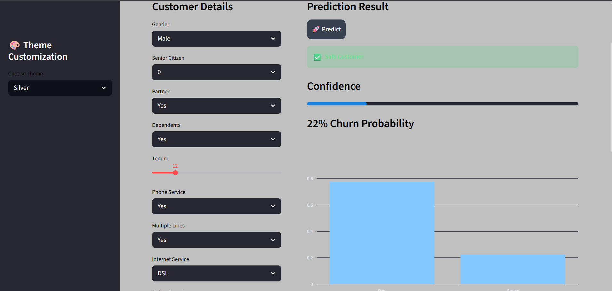
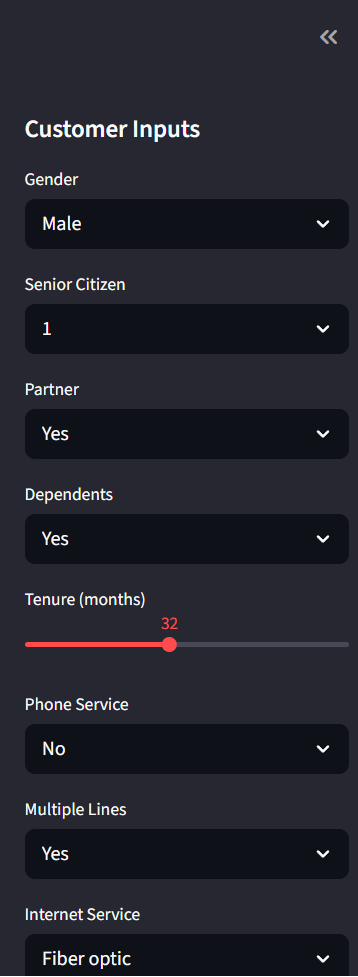
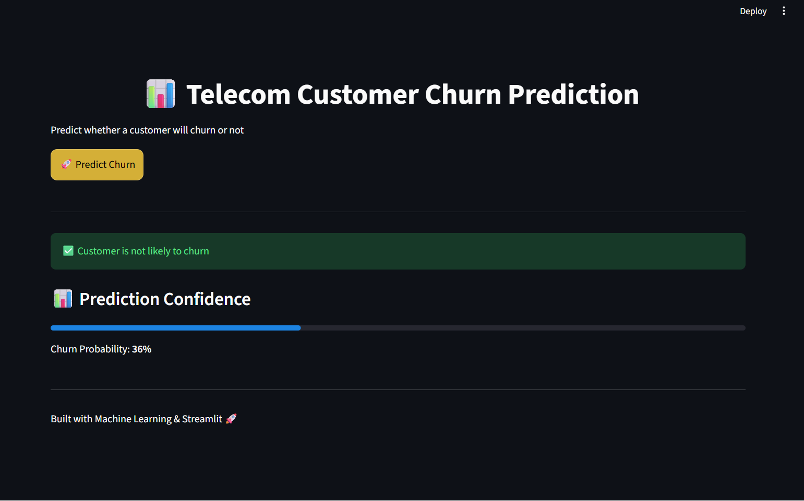

# 📊 Telecom Customer Churn Prediction

## 🌐 Live Demo
[Click here to use the app]                       https://teleco-churn-ml-app-eka.streamlit.app/

## 🚀 Overview
This project predicts whether a telecom customer is likely to churn using Machine Learning.

## 🎯 Features
- End-to-end ML pipeline (preprocessing + model)
- Real-time prediction using Streamlit
- Probability-based output
- Clean and interactive UI

## 🧠 Model
- Random Forest Classifier
- Pipeline with ColumnTransformer
- ROC-AUC optimized

## 📂 Tech Stack
- Python
- Scikit-learn
- Streamlit

## ▶️ How to Run

```bash
pip install -r requirements.txt
streamlit run app.py

## 📸 App Preview



## 📸 App Preview

### 🔹 Input Section


### 🔹 Prediction Result
